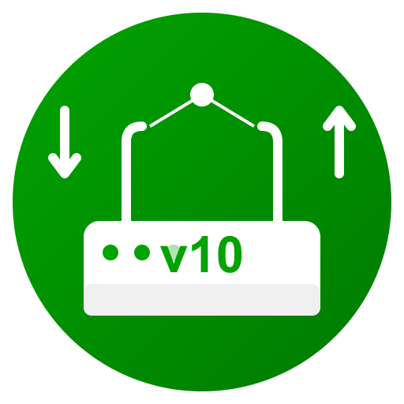

<div align="center">
  
</div>

# Domoticz KPN Experia Box V10 Device Tracker

Welcome! This is an upcoming Python plugin for Domoticz designed to track the presence of devices connected to your trusty KPN Experia Box V10. 

⚠️ **Current Status: Skeleton Phase!** ⚠️
Right now, the plugin is just an empty shell. It has the Domoticz UI configuration parameters set up, but the actual logic to talk to the router is not yet implemented. If you install it, it won't do much (yet!).

## 🚀 Features (Planned)
* **Who's home?** Tracks all connected LAN and WLAN devices using robust network topology traversal.
* **Dialect support:** Fluent in both the old router language and the shiny new "KPN Software" (V10.C.26.02.06+) dialect.
* **Speed & Greed:** Real-time download/upload speeds and total data consumption.
* **Vitals:** External IP, WAN link status, active client count, and router uptime.
* **Intruder Alert:** Warns you when a wild new device appears on your network.
* **The Big Buttons:** Reboot the router or toggle Guest Wi-Fi straight from Domoticz.

## 🛠️ Installation

1. Grab the plugin and toss it into your Domoticz plugins folder:
   ```bash
   cd domoticz/plugins
   git clone https://github.com/adrighem/domoticz-kpn-experia-v10.git experiav10
   ```
2. Give Domoticz a quick reboot:
   ```bash
   sudo systemctl restart domoticz
   ```
3. Head to **Setup** -> **Hardware** in your Domoticz UI.
4. Add **KPN Experia Box V10 Device Tracker**.
5. Feed it your Router IP, Username, and Password.
6. Click **Add** and watch the magic happen! ✨

## 📜 License
Licensed under [GPLv3](LICENSE) — free to use, share, and improve.
